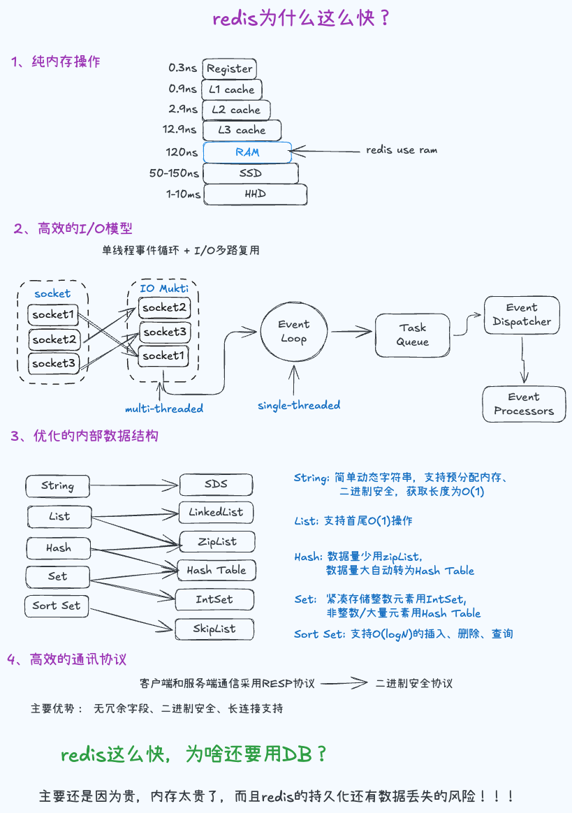

# Redis为什么那么快？

### 1、纯内存操作 (Memory-Based Storage) ：
这是 Redis 快的 最核心前提。Redis 的所有数据都存储在 内存（RAM） 中，而传统数据库（如 MySQL）的 data/file 存储在 磁盘（HDD/SSD） 中。内存读写速度是 微秒级（10⁻⁶秒），磁盘读写是 毫秒级（10⁻³ 秒），两者相差 1000 倍以上（即使是 SSD，也比内存慢几十到上百倍）。

### 2、高效的 I/O 模型 (I/O Multiplexing & Single-Threaded Event Loop) ：
Redis 使用单线程事件循环 + I/O 多路复用技术，单个线程让所有读写请求串行执行，无需锁机制，也没有线程切换开销，每个请求的执行效率极高。
I/O 多路复用技术指的是：Redis 主线程通过 epoll 同时监听 所有客户端的 Socket 连接，当某个连接有数据可读 / 可写时，epoll 会通知主线程处理该连接，而非逐个轮询。
### 3、优化的内部数据结构 (Optimized Data Structures) ：
Redis 提供多种数据类型（如 String, List, Hash, Set, Sorted Set 等），其内部实现采用高度优化的编码方式（如 ziplist, quicklist, skiplist, hashtable 等）。Redis 会根据数据大小和类型动态选择最合适的内部编码，以在性能和空间效率之间取得最佳平衡。
举几个关键例子：
- String：底层是「简单动态字符串（SDS）」，支持预分配内存（减少扩容开销）、二进制安全（可存储图片 / 视频等二进制数据），且获取长度是 O (1)（原生 C 字符串是 O (n)）。
- Hash：底层是「哈希表 + 压缩列表（ziplist）」，当数据量小时用 ziplist（紧凑存储，减少内存碎片），数据量大时自动转哈希表（O (1) 查找）。
- ZSet（有序集合）：底层是「跳表（Skip List）+ 哈希表」，跳表支持 O (logN) 的插入 / 删除 / 查询，比平衡二叉树（如红黑树）实现更简单、性能更稳定；哈希表用于快速查询元素是否存在。
- List：底层是「双向链表 + 压缩列表」，支持首尾 O (1) 操作，适合做队列 / 栈。
这些定制化结构的核心优势：操作快 + 内存省，避免了冗余存储和复杂计算。

### 4、简洁高效的通信协议 (Simple Protocol - RESP) ：
Redis 客户端与服务端通信使用 RESP 协议（Redis Serialization Protocol），这是一种「二进制安全的文本协议」，设计目标是「简单、快速解析」。

- 无冗余字段：HTTP 协议有大量头部字段（如 Host、Cookie、Content-Type），解析复杂；RESP 协议格式极简（如 SET key value 仅需简单的字符串拆分），服务端无需复杂解析。
- 二进制安全：支持直接传输二进制数据，无需转义（如 JSON 需转义特殊字符），减少编码 / 解码开销。
- 长连接支持：客户端与 Redis 建立 TCP 长连接，避免频繁建立 / 关闭连接的「三次握手 / 四次挥手」开销，进一步提升吞吐量。

### 5、总结Redis 快的核心逻辑
「内存存储（根本） + 单线程模型（无并发开销）+ I/O 多路复用（高并发支撑）+ 高效数据结构（快操作）+ 精简协议（低解析开销）」，从存储、架构、数据、通信全链路消除了性能瓶颈，最终实现「低延迟 + 高吞吐量」。
⚠️ 注意：Redis 单线程模型的瓶颈是 CPU 单核性能（而非并发连接数），如果遇到 CPU 密集型操作（如复杂的 Lua 脚本、大键扫描），会阻塞主线程。因此 Redis 不适合做复杂计算，仅专注于「高效的键值存储与读写」。

