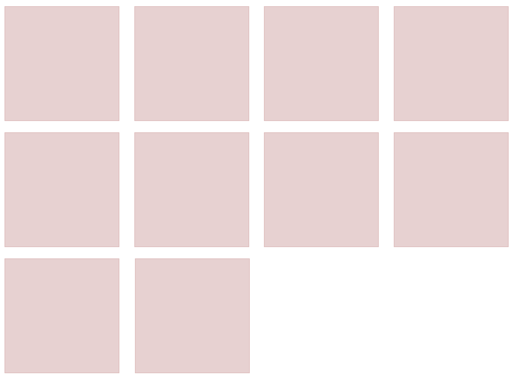

# flex布局怎么让最后一行元素靠左排列?



## 一、傀儡元素
html代码：
```html
<div class="contain">
    <div class="item"></div>
    <div class="item"></div>
    <div class="item"></div>
    <div class="item"></div>
    <div class="item"></div>
    <div class="item"></div>
    <div class="item"></div>
    <div class="item"></div>
    <div class="item"></div>
    <div class="item"></div>
    <!-- dumy -->
    <div class="item dumy"></div>
    <div class="item dumy"></div>
    <div class="item dumy"></div>
    <div class="item dumy"></div>
    <div class="item dumy"></div>
</div>
```
css代码：
```css
.contain{
    display: flex;
    flex-wrap: wrap;
    justify-content: space-between;
}
.item{
    width: 200px;
    height: 200px;
    margin-top: 20px;
    border: 1px solid rgb(226, 182, 182);
    background: rgb(236, 208, 208);
}
.dumy{
    width: 200px;
    height: 0px;
    border-width: 0px;
}
```

### 简单写一下`dumy`元素：
html代码：
```html
<div class="contain">
    <div class="item"></div>
    <div class="item"></div>
    <div class="item"></div>
    <div class="item"></div>
    <div class="item"></div>
    <div class="item"></div>
    <div class="item"></div>
    <div class="item"></div>
    <div class="item"></div>
    <div class="item"></div>
    <!-- dumy -->
    <i></i>
    <i></i>
    <i></i>
    <i></i>
    <i></i>
    <i></i>
    <i></i>
</div>
```
css代码：
```css
.contain{
    display: flex;
    flex-wrap: wrap;
    justify-content: space-between;
}
.contain > i{
    width: 200px;
}
```
### 缺点：
当每行元素个数大于傀儡元素个数的时候会有问题，所以得保证傀儡元素足够多。


## 二、grid布局
html代码：
```html
<div class="contain1">
    <div class="item1"></div>
    <div class="item1"></div>
    <div class="item1"></div>
    <div class="item1"></div>
    <div class="item1"></div>
    <div class="item1"></div>
    <div class="item1"></div>
    <div class="item1"></div>
    <div class="item1"></div>
    <div class="item1"></div>
</div>
```
css代码：
```css
.contain1 {
    display: grid;
    justify-content: space-between;
    grid-template-columns: repeat(auto-fill, 200px);
}
.item1 {
    width: 200px;
    height: 200px;
    background-color: skyblue;
    margin-top: 20px;
}
```
### 缺点：
grid的兼容问题，其实正常的业务也不用考虑这个缺点了。
