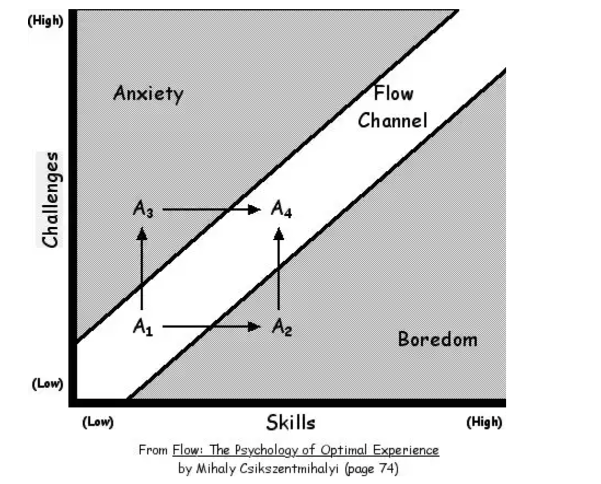
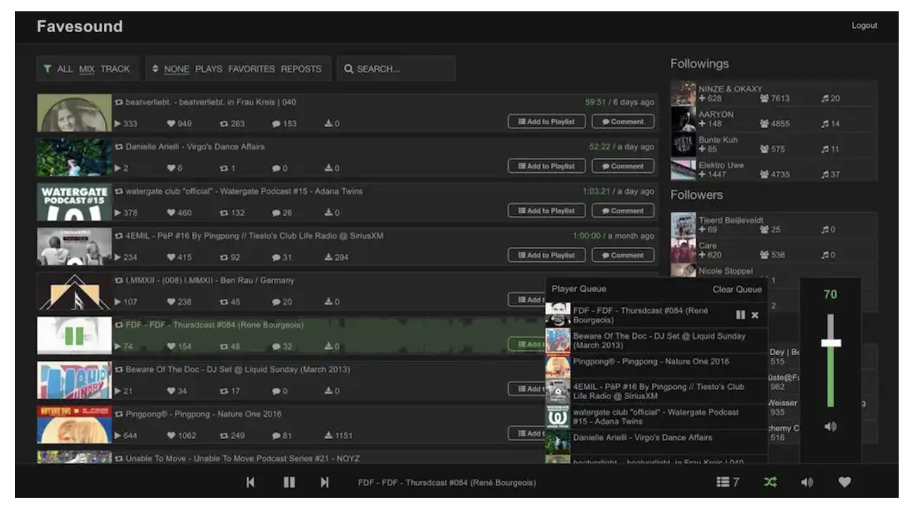

# 如何学习JS框架

## 一、写在前面

JavaScript和Web开发社区发展迅速，新框架不断更新迭代。现在有很多人在学习React、Angular、Vue或Svelte。他们不仅像过去那样是计算机科学专业的毕业生，而且还是来自训练营和其他背景的自学成才的程序员。而且企业在招聘的时候也不在一味注重计算机科学专业的毕业生，而是更注重有经验的程序员。

那么如何系统的自学JavaScript框架呢？

下面的文章是我有关如何学习JavaScript框架的见解。它或许可以帮助你摆脱迷茫，减少内耗。

## 二、REACT,ANGULAR,VUE,SVELTE?

我只能只能站在一个JavaScript生态系统初学者的角度提点感受。如今的前端领域，每个人都在追逐最闪亮的创新。但那其实只是在各个知识社区看到的东西。现实世界中的公司却很少使用最新技术。市面上80%的公司必须坚持多年前的选择。这是因为他们的主要目标是增加业务价值，而不是每年更换底层技术堆栈。公司招纳你的目的是：你可以为公司、客户的产品提供的价值，而不是你随身携带的技术堆栈。

每天都有人询问要学习和使用这些主要框架中的哪一个。是Angular、Vue还是React？我也经常在前端社区上看一些这样的问题，但完全跟不上节奏。这些问题整天都在出现，所以我打算提提我的见解。

### 2.1 摆脱分析瘫痪

无论从技术比较还是第一手经验来看，很多文章都给人一种分析瘫痪的感觉。其中许多文章没有立即产生影响，因为它们最终没有提供明确的可行建议。他们只是为消费者友好的读者提供更多的输入。他们的读者并没有推动他们进行创作，而是继续消费并从一篇文章转到另一篇文章。他们从来没有开始学习事物本身。他们消费，但永远不会最终生产。

毕竟，如果你想学习新东西，你就必须从消费跨越到生产。选择Vue、Angular、Svelte还是React并不重要，因为它们都解决相同的问题。它们使您能够构建Web应用程序。就是这样。不管你相信与否，如果你掌握了其中一种，那么使用另一种并不困难。

如果你还停留在分析瘫痪状态，或许明年还会有另一个框架需要学习。所以这只是让你越来越迷茫。生产！不要消费！！！

### 2.2 JavaScript是基础，其他都不重要......

毕竟，JavaScript是任何JS框架的基础。如果你已经积累了足够的JS知识，那么你不应该太担心你现在正在学习和使用的框架。JavaScript应该为您提供使用任何这些框架的所有工具。因此，你的最终目标应该是掌握JavaScript，而不是一个可能只与你相关一年的框架。

掌握JavaScript的核心原理。无论您采用自下而上（JavaScript->框架）还是自上而下（框架->JavaScript）方法，都取决于您个人的学习方法。重要的是您了解JavaScript，可以轻松地从一个框架迁移到另一个框架。它不仅适用于React、Vue、Svelte或Angular，还适用于Redux或MobX等库。当您从一种技术转向另一种技术时，您将需要了解底层机制。因此，请花点时间了解这些核心原则：

- Functions是JavaScript中的一等公民
- bind(),apply(),andcall()
- 作用域和闭包
- this
- 对象（例如Object.keys(myObj).map(key=>myMap[key])）
- 数组（例如[1,2].reduce((sum,summand)=>sum+summand,0)）
- 原型继承->ES6类
- 回调和Promise
- 事件循环
- 事件冒泡
- 正则表达式
- 错误处理（promise.then(...).catch(...)、try{}catch(e){}）
- JavaScriptES6及更高版本
- 提升、记忆
- 声明式编程与命令式编程
- 函数式编程与面向对象编程

你不需要成为这些事情的巫师。但至少掌握这些原则，可以了解JavaScript的工作原理以及如何在不依赖重量级框架/库的情况下使用它。例如，人们过早地引入了Lodash等实用程序库。但大多数基本情况都可以使用普通JavaScript来完成。

并不是每个人都有经济能力去学习任何东西。这很耗时。如果您经济上受到限制，最重要的建议是密切关注就业市场。您的自由职业客户可能并不关心您是否使用Vue、React、Svelte或Angular构建了他们闪亮的Web应用程序，但就业市场显示了公司发展的明确趋势。密切关注它以了解一些相关的内容。

## 三、让我们开始吧

我坚信学习应该缩小学习材料的范围，为更轻松地学习东西铺平道路。因此在网上购买10门课程并没有什么帮助。这是一个永无止境的消费者故事，实际上您永远不会亲自编程。同样，社区上有很多故事，人们都在谈论同样的问题：他们观看了所有视频课程，而且看的都很顺利，然鹅他们不知道如何开始编码。

相反，如果您有很多时间来学习学习材料，请尝试增加其中的多样性。参加一门视频课程，并辅之以一本书、一个播客和一门带有编码游乐场的真实实践课程，以刺激所有感官。这就是我学习的方式。如果您正在编写个人项目，那么您应该能够平衡未来的挑战和技能。最终你会进入一种流畅的状态。

如果你觉得自己属于这群消费过多的人，那么对你来说最重要的一步就是开始生产。我相信您现在已经消耗了大量的学习材料，所以坐下来开始使用您选择的框架编写一些代码。如果您遇到困难，请使用您最喜欢的搜索引擎、在StackOverflow上提问或加入各种前端社区以获取其他人的帮助。

学习新东西绝非易事。有人在一小时内毫不费力地在视频截屏中构建出一个东西，而不会出一身冷汗，而你需要花费很长时间和大量的努力来实现同样的东西。但这是正常的。99%的视频课程都准备好展示最佳方式并隐藏努力。这就是为什么观看如此令人愉快。人类本质上会避免有压力的事情。然而，出一身冷汗并花很长时间去实现这件事实际上可以帮助你学习这门学科。所以坐下来开始编码吧。

## 四、选择一个项目

那么如何开始编写Vue、Angular、Svelte或React代码呢？选择一个能激励你的项目。选择您最喜欢的爱好并为其构建一个应用程序。它不需要是一个成熟的应用程序。如果您喜欢数学，请使用计算器。从简单的开始。

此时，如果您仍然处于分析瘫痪状态，请在所有框架中实现相同的计算器。保持项目较小，这样就不会花费太多时间来比较主要框架。例如，在写计算器的时候，仅实现加法、减法、乘法和除法功能。最后，选择感觉最舒服的框架并使用它。

如果您没有想实现的项目，请看看其他开发人员正在构建什么来学习Svelte、React、Angular或Vue。他们中的大多数人在社区上分享他们的努力。让他们激励你，尝试做类似的事情或者只是尝试复制他们。

如果您没有爱好（什么？）并且没有人激励您（不可能！），获得灵感的第三种方法是克隆您最喜欢的Web应用程序。最重要的建议是：保持项目规模可控，并有一个激励性的主题来推动您完成项目中的麻烦部分。

那么构建第一个项目后会发生什么？在社区上分享，获取反馈。成为这些平台上的生产者-而不仅仅是消费者。充分参与社区将帮助您获得大量反馈，从而帮助您成长。带着这些反馈，改进您的项目，然后启动另一个项目，以了解有关使用框架的更多信息。对每个专注于通用编码、JavaScript或框架的新内容的项目重复学习过程。每个项目都有自己的挑战和学习机会。

最后，学习任何框架都可以归结为这个简单的过程：

(1) 缩小你的学习材料并补充适合你所有感官的项目
(2) 消耗学习材料并开始副业制作
(3) 选择一个能让你保持动力的项目
(4) 冒出一身冷汗，花几个小时修改你的项目
(5) 使用搜索引擎、AI、Discord或StackOverflow寻求帮助
(6) 完成你的项目并收集其他人的反馈
(7) 如果陷入分析瘫痪，在另一个框架中实现相同的项目
重复(3)至(6)
我希望这篇文章能够鼓励您开始学习React、Svelte、Vue、Angular或任何其他框架。选择哪一个并不重要，但你必须实现从消费到生产的跨越。现在开始编码。一路走来，更好地理解JavaScript的核心原理。我相信，如果您现在开始学习其中之一，您今年就可以使用其中一种解决方案在就业市场上取得成功。

