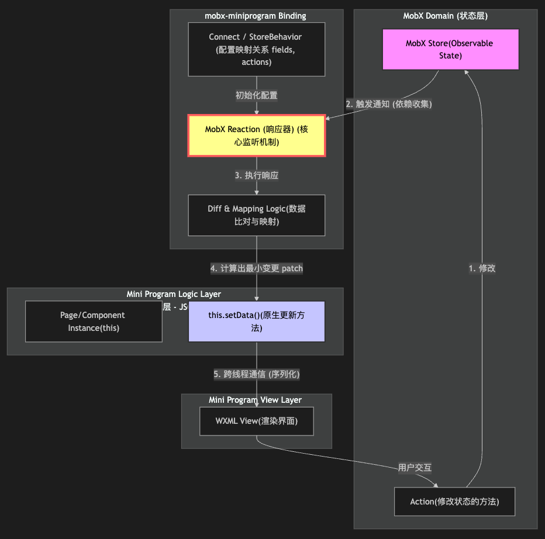

# mobx miniprogram的原理
`mobx-miniprogram` 的核心价值在于它巧妙地连接了 MobX 强大的响应式系统和小程序独特的双线程架构，解决了原生开发中状态管理混乱和 `setData` 性能低下的痛点。

### 核心原理图解

这张图展示了数据是如何从 MobX Store 流向小程序视图层，以及 `mobx-miniprogram` 在其中扮演的“智能桥梁”角色。

---

### 具体实现逻辑深度解析

`mobx-miniprogram` 的工作流程可以拆解为四个关键阶段：**初始化连接、依赖收集、响应式触发、精准更新**。

#### 1. 初始化连接 (Initialization & Connection)

当你使用 `StoreBehavior` 或者 `createStoreBindings` 将小程序页面/组件与 MobX store 连接时，库的内部代码会介入小程序的生命周期（如 `onLoad`, `attached`）。

**具体逻辑：**

* **读取配置**：库会读取你传入的配置对象，重点是 `fields`（你需要哪些数据）和 `actions`（你需要哪些操作方法）。
* **映射 Actions**：将 store 中的方法直接挂载到当前页面/组件实例（`this`）上，方便直接调用。
* **创建 Reaction宿主**：在当前组件实例上创建一个专门用于管理 MobX 监听器的容器。

#### 2. 依赖收集 (Dependency Collection) —— 核心魔法

这是 MobX 最神奇的地方。它不需要你手动声明“当 A 变化时更新 B”，而是自动侦测。

**具体逻辑：**

* 在初始化阶段，`mobx-miniprogram` 会创建一个 **MobX Reaction（响应器）**。
* 这个 Reaction 会立即执行一次**预读逻辑**。它会遍历你在 `fields` 中声明的所有字段，并尝试从 MobX Store 中读取它们的值。
* **关键点**：由于 MobX Store 的数据是被 Proxy (或 Object.defineProperty) 包裹的。当你“读取”属性时，MobX 内部机制会捕获到这个读取操作，并将当前的 Reaction 记录为该属性的“观察者（Observer）”。
* **结果**：建立了一张隐形的依赖图。例如，如果你的组件只读取了 `store.userInfo.name`，那么只有当 `name` 发生变化时，这个组件才会被标记为需要更新。如果 `store.otherData` 变了，这个组件完全无感。

#### 3. 响应式触发 (Reactivity Trigger)

当应用运行起来后，用户交互触发了某个 `Action`。

**具体逻辑：**

* **修改状态**：Action 里的代码修改了 Store 中的 Observable 数据。
* **通知观察者**：MobX 监测到数据变化，它会查找依赖图，找到所有“观察”了这个数据的 Reaction。
* **触发执行**：MobX 通知这些 Reaction 重新运行。

#### 4. 精准更新 (Optimized Update & setData) —— 性能关键

这是 `mobx-miniprogram` 区别于普通 MobX 使用场景的地方，它专门为小程序做了优化。

**具体逻辑：**

* **Reaction 重新运行**：当第 3 步的 Reaction 被触发时，它并不是简单地把整个 Store 塞给小程序。
* **Diff 与 映射**：它会重新计算 `fields` 中映射的数据的最新值。它会将新值与当前小程序 `data` 中的旧值进行比对（或者直接提取映射后的新对象）。
* **构造 Patch**：它会生成一个只包含**真正变化了的数据**的补丁对象（Patch）。
* *例如：Store 里有 100 个属性，你只用了 2 个，且这次只有一个属性变了，那么 Patch 对象里就只有那一个键值对。*

* **调用 setData**：最后，它调用小程序的原生 API `this.setData(patch)`。

### 总结：它解决了什么？

1. **解决了“手动挡”的繁琐**：你不再需要手动在逻辑代码里到处写 `this.setData`，数据变了，界面自动就变了。
2. **解决了性能瓶颈**：
* 原生开发中，新手容易犯的错误是 `this.setData({ 全量大对象 })`，导致庞大的数据在逻辑层和视图层之间进行序列化和传输，造成卡顿。
* `mobx-miniprogram` 通过精确的依赖收集，确保了每次 `setData` 传输的数据量是**最小必要**的，从而保证了高性能。