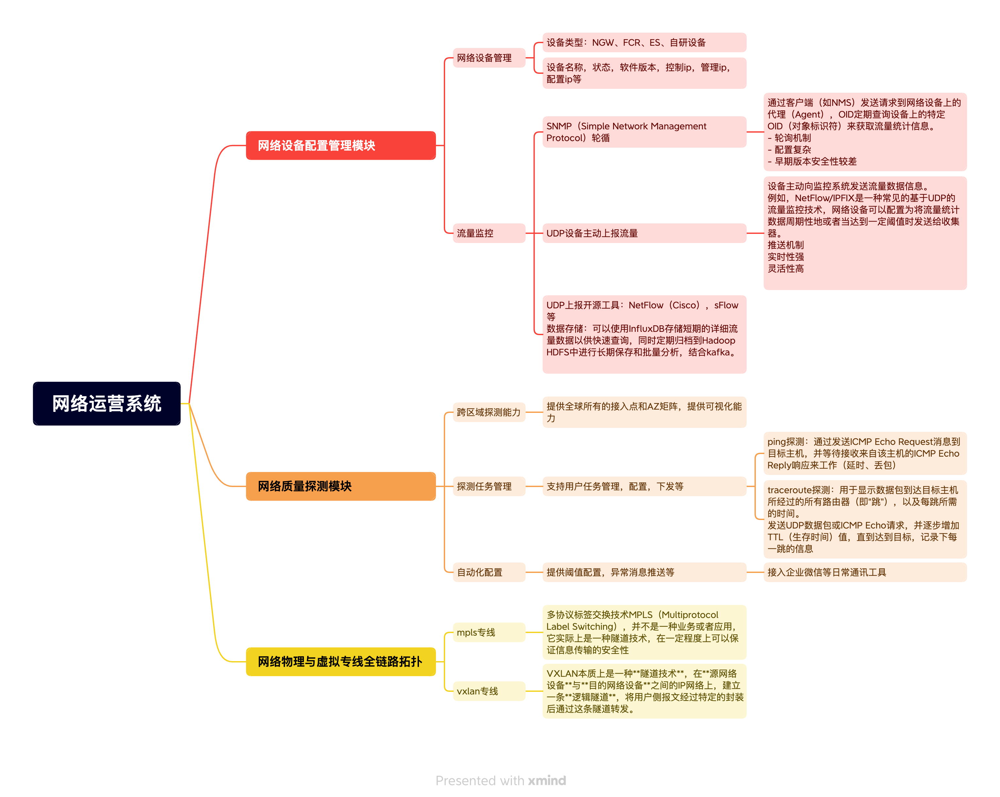

## 一、网络设备配置管理模块
### 模块设计与开发：
> 主导构建统一的网络设备配置管理模块，实现设备、设备组的集中管理功能，支持设备状态和网元信息的同步。

管理IP、配置IP、控制IP、设备状态、维护状态、软件版本等

### 流量实时监控：
> 基于 SNMP 协议及设备流量UDP上报机制，实现设备网元流量的实时采集、分析与监控，提供可视化的流量动态展示。

在网络设备管理和监控中，SNMP（Simple Network Management Protocol）流量监控和UDP设备主动上报流量是两种不同的方法，它们各自有独特的应用场景、优点和局限性。下面将从几个方面对比这两种技术：

#### SNMP流量监控

**工作原理**
- SNMP是一种应用层协议，主要用于网络管理。它通过客户端（如网络管理系统NMS）发送请求到网络设备上的代理（Agent），以获取设备的状态信息或设置设备参数。
- 在流量监控的场景下，NMS会定期查询设备上的特定OID（对象标识符）来获取流量统计信息，比如接口接收到的字节数（`ifInOctets`）、发送的字节数（`ifOutOctets`）等。

**特点**
- **轮询机制**：SNMP主要依赖于NMS对设备进行轮询来收集数据，这意味着NMS需要主动发起请求才能获得更新的信息。
- **配置复杂度**：为了确保准确的数据采集，管理员需要仔细配置轮询频率、选择合适的MIBs以及处理可能出现的性能问题（例如过多的轮询可能会影响设备性能）。
- **安全性**：SNMPv3提供了认证和加密功能，提高了安全性，而早期版本（SNMPv1/v2c）使用明文传输，安全性较差。

#### UDP设备主动上报流量

**工作原理**
- 设备主动上报通常指的是设备在发生某些事件时，直接向监控系统发送通知，而不是等待被询问。这种方式通常利用UDP协议实现，因为UDP不需要建立连接且开销小，适合用于频繁的状态报告或日志记录。
- 例如，NetFlow/IPFIX是一种常见的基于UDP的流量监控技术，网络设备可以配置为将流量统计数据周期性地或者当达到一定阈值时发送给收集器。

**特点**
- **推送机制**：与SNMP不同，这种模式下设备主动将信息推送给监控系统，减少了对设备资源的需求，因为它不需要响应频繁的查询请求。
- **实时性强**：由于数据是实时上报的，因此能够更快地反映网络状态的变化，对于快速检测和响应网络故障非常有用。
- **灵活性高**：可以根据实际需求灵活调整上报的内容和频率，适应不同的监控需求。

#### 区别总结

- **数据获取方式**：SNMP采用的是拉取模式，即由NMS定期请求数据；而UDP设备主动上报则是推送模式，设备根据设定条件自行发送数据。
- **适用场景**：SNMP适用于需要详细配置和长期稳定监控的情况，尤其是当需要获取多种类型的数据时；UDP设备主动上报更适合于需要即时反馈和高效率传输的场景，如大规模网络中的流量分析。
- **资源消耗**：频繁的SNMP轮询可能会增加设备和网络的负担，而UDP上报虽然减轻了这一负担，但如果设计不当，可能导致大量无用数据的传输，占用带宽。

选择哪种方法取决于具体的网络环境、监控需求以及对成本和性能的考量。有时候，结合两者的优势，可以构建更加完善有效的监控体系。

UDP上报开源工具：NetFlow（Cisco），sFlow等
数据存储：可以使用InfluxDB存储短期的详细流量数据以供快速查询，同时定期归档到Hadoop HDFS中进行长期保存和批量分析，结合kafka。

### 高效性能优化：
> 通过优化数据采集与处理流程，提高网元状态同步与流量监控的性能，显著降低延时，确保监控数据的实时性与准确性。

## 二、网络质量探测模块
> 跨区域探测能力：设计并开发了针对大区内 AZ（NGW 集群）与接入点（交换机）间的网络质量探测
模块，支持延时、丢包等多维指标监控。

> 探测任务管理：提供灵活的探测任务管理功能，包括任务创建、调度与结果展示，支持用户自定义探测
阈值与任务周期。

> 自动化配置：实现 IP 录入、阈值设置等操作的自动化，降低了人工配置的复杂性，提升探测任务管理
的效率。

**基于Ping\Traceroute技术**

## 三、网络物理与虚拟专线全链路拓扑

> 全链路拓扑展示：构建从用户 VPC 到 IDC 的专线链路全景视图，覆盖 VXLAN、MPLS 和 Hybrid 专线，
帮助运维人员全面了解网络拓扑结构。

> 协议与探测信息集成：整合并展示 VNI 信息、EBGP/IBGP 配置、BFD 探测数据，提供从虚拟网络到物
理链路的全链路信息透视能力。

> 稳定性与可用性优化：通过链路冗余与状态监控，提升专线链路的可靠性，为关键业务提供高可用的网
络传输保障。

### VXLAN

#### 1、什么是VXLAN

VXLAN（Virtual eXtensible Local Area Network，**虚拟扩展局域网**），是由IETF定义的NVO3（Network Virtualization over Layer 3）标准技术之一，是对传统VLAN协议的一种扩展。
VXLAN本质上是一种**隧道技术**，在**源网络设备**与**目的网络设备**之间的IP网络上，建立一条**逻辑隧道**，将用户侧报文经过特定的封装后通过这条隧道转发。

#### 2、VXLAN优势

- 虚拟机动态迁移
- 多租户隔离

###### 3.1 VXLAN VTEP

VTEP（VXLAN Tunnel Endpoints，VXLAN隧道端点）是VXLAN网络的边缘设备，是VXLAN隧道的起点和终点，VXLAN对用户原始数据帧的封装和解封装均在VTEP上进行。

###### 3.2 VXLAN VNI

VNI（VXLAN Network Identifier，VXLAN 网络标识符），VNI是一种类似于VLAN ID的用户标识，一个VNI代表了一个租户，属于不同VNI的虚拟机之间不能直接进行二层通信。

#### 4、VXLAN专线

大概流程：

1、客户IDC的核心路由器通过物理专线和虚拟专线（一条物理专线可虚出多条虚拟专线）接入腾讯的接入交换机，这里的虚拟通道用PVI(public virtual interface)表示。

2、接入交换机把用户的VLAN信息包装成能在VXLAN隧道上传输的报文，通过VXLAN隧道特定的VXLAN隧道传输到DCGW(专线接入点)。

3、此时两个AS的FCR集群通过EBGP学习了客户IDC中的CR路由配置信息等，并通过IBGP“共享”给PL_Router集群；

4、FCR集群中的路由信息统一上报到NFVC，NFVC编排下发到PL_V3_GW集群进行转发；

#### 参考

https://support.huawei.com/enterprise/zh/doc/EDOC1100087027

### MPLS

#### 1、什么是MPLS

多协议标签交换技术MPLS（Multiprotocol Label Switching），并不是一种业务或者应用，它实际上是一种隧道技术，在一定程度上可以保证信息传输的安全性。

#### 2、MPLS L3 VPN网络的作用

支持不同VPN中IP地址重叠，IDC A --> VPC A，IDC B --> VPC B在传输链路中存在IP重叠，并且流量达到转发设备时要区分哪个流量转发的目的地。MPLS L3 VPN网络中通过多个独立路由表来解决这个问题，不用的VPN在QCAR上有不同的独立路由表等配置。

VRFs就是独立路由表，全称VPN Routing and Forwarding tables。

- IDC->QCAR：QCAR有多个独立路由表如：VRF A、VRF B和IDC A、IDC B对应；
- MP-BGP：把QCAR中的多个路由表传递给ES，两个不同的VPN要通过仅有的一个BGP session来传递路由。为了区分MP-BGP携带不同的RT(Route Target，相当于标记BGP属于哪个VPN)；
- ES- NGW：静态路由传递给NGW，NGW得到不用VPN的路由信息转发相应的流量到不同的IDC；

#### 3、MPLS专线

大致流程：

- 客户IDC的核心路由器通过物理专线虚出的虚拟专线接入到QCAR中；
- QCAR通过EBGP学习相关的路由配置，分配给不同客户不同的VRF（独立路由表）；
- ES和QCAR都通过IBGP连接路由反射器QCRR，ES学习QCAR中的路由信息，就可以区分通过MPLS过来的流量了；
- ES 交换机和NGW采用静态路由传递路由信息，NGW就可以转发不同的流量到不同的VPC了；
- FCR.BD连接NFVC和QCRR，起到桥梁作用；

#### 参考：

https://zhuanlan.zhihu.com/p/27539826

https://support.huawei.com/enterprise/zh/doc/EDOC1100116697/953f01ce

