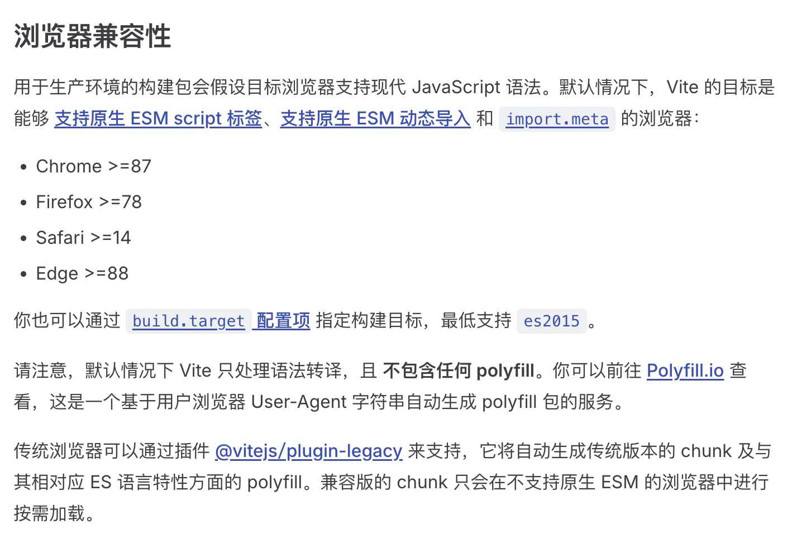
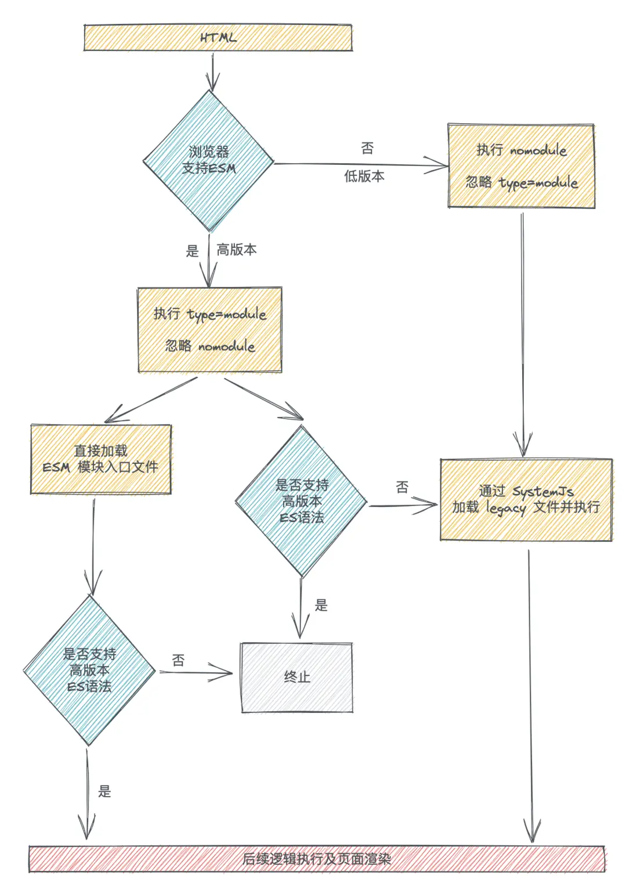

# @vite/plugin-legacy解读

## 一、是什么？

vite文档关于浏览器兼容介绍了@vitejs/plugin-legacy，还说了**传统浏览器可以通过插件@vitejs/plugin-legacy来支持，它将自动生成传统版本的chunk及与其相对应ES语言特性方面的 polyfill。兼容版的chunk只会在不支持原生ESM的浏览器中进行按需加载。**

可以见得@vitejs/plugin-legacy插件主要做了以下几件事：

- 自动生成传统版本的chunk
- 自动生成与传统版本对应的polyfill
- 区分出传统浏览器，实现按需加载兼容版chunk

## 二、从打包产物入手

### 2.1 使用@vitejs/plugin-legacy插件打包出来的index.html文件：
```html
<!doctype html>
<html lang="en">
  <head>
    <meta charset="UTF-8" />
    <link rel="icon" href="/favicon.ico" />
    <meta name="viewport" content="width=device-width, initial-scale=1.0" />
    <title>Vite App</title>
    <script type="module" crossorigin src="/assets/index-Bhz8XoBG.js"></script>
    <link rel="stylesheet" crossorigin href="/assets/index-CimjwQag.css" />
    <script type="module">
      import.meta.url
      import('_').catch(() => 1)
      ;(async function* () {})().next()
      if (location.protocol != 'file:') {
        window.__vite_is_modern_browser = true
      }
    </script>
    <script type="module">
      !(function () {
        if (window.__vite_is_modern_browser) return
        console.warn(
          'vite: loading legacy chunks, syntax error above and the same error below should be ignored'
        )
        var e = document.getElementById('vite-legacy-polyfill'),
          n = document.createElement('script')
        ;(n.src = e.src),
          (n.onload = function () {
            System.import(document.getElementById('vite-legacy-entry').getAttribute('data-src'))
          }),
          document.body.appendChild(n)
      })()
    </script>
  </head>
  <body>
    <div id="app"></div>
    <script nomodule>
      !(function () {
        var e = document,
          t = e.createElement('script')
        if (!('noModule' in t) && 'onbeforeload' in t) {
          var n = !1
          e.addEventListener(
            'beforeload',
            function (e) {
              if (e.target === t) n = !0
              else if (!e.target.hasAttribute('nomodule') || !n) return
              e.preventDefault()
            },
            !0
          ),
            (t.type = 'module'),
            (t.src = '.'),
            e.head.appendChild(t),
            t.remove()
        }
      })()
    </script>
    <script
      nomodule
      crossorigin
      id="vite-legacy-polyfill"
      src="/assets/polyfills-legacy-f_YiQI9j.js"
    ></script>
    <script 
      nomodule 
      crossorigin 
      id="vite-legacy-entry" 
      data-src="/assets/index-legacy-Bo7ToFt0.js"
    >
      System.import(document.getElementById('vite-legacy-entry').getAttribute('data-src'))
    </script>
  </body>
</html>

```
### 2.2 仔细看这段代码前先了解一下`<script>`标签中的type=module和nomodule属性在MDN中的解释：
- type="module": 此值导致代码被视为 JavaScript 模块。其中的代码内容会延后处理。charset 和 defer 属性不会生效。
- nomodule: 用来标明这个脚本不应该在支持 ES 模块的浏览器中执行。实际上，这可用于在不支持模块化JavaScript的旧浏览器中提供回退脚本。与传统代码不同的是，模块代码需要使用 CORS 协议来跨源获取。

简单来说，携带type=module的script标签在支持ESM的浏览器执行，在不支持ESM的浏览器中不执行。标明nomodule的script标签在支持ESM的浏览器中不执行，在不支持ESM的浏览器中执行。

### 2.3 接下来分析一下这个打包后的index.html代码：

1、在支持ESM的浏览器加载`index-Bhz8XoBG.js`：
```html
<script type="module" crossorigin src="/assets/index-Bhz8XoBG.js"></script>
```

2、在支持ESM的浏览器执行以下代码：
```html
<script type="module">
  import.meta.url
  import('_').catch(() => 1)
  ;(async function* () {})().next()
  if (location.protocol != 'file:') {
    window.__vite_is_modern_browser = true
  }
</script>
```
在type="module"中，如果执行代码出错，就会终止之后的代码执行，比如：`import.meta.url`报错了，那么它之后的代码`import('_').catch(() => 1)`将不在执行。需要注意的是：**报错只阻断了同一个module模块中的代码执行，不会影响下一个module代码执行。** 由此可见，只有以上所有的语法都不报错，是否是现代浏览器标志`__vite_is_modern_browser`才会被置成`true`。

3、处理“非现代浏览器”：
```html
<script type="module">
    !(function () {
    if (window.__vite_is_modern_browser) return
    console.warn(
        'vite: loading legacy chunks, syntax error above and the same error below should be ignored'
    )
    var e = document.getElementById('vite-legacy-polyfill'),
        n = document.createElement('script')
    ;(n.src = e.src),
        (n.onload = function () {
        System.import(document.getElementById('vite-legacy-entry').getAttribute('data-src'))
        }),
        document.body.appendChild(n)
    })()
</script>
```
这段代码，判断了上面说的是否现代浏览器标志`__vite_is_modern_browser`，如果为`true`说明现代浏览器对应的资源`index-Bhz8XoBG.js`已经加载，所以直接return，无需后面的处理就能正常加载页面。

如果`__vite_is_modern_browser`为`false`，说明是“非现代浏览器”，就需要做兼容代码加载了，所以就有了后面的代码，使用SystemJs加载兼容文件。

4、index.html里的`<body>`加载的内容：
```html
<script nomodule>
    !(function () {
        var e = document,
            t = e.createElement('script')
        if (!('noModule' in t) && 'onbeforeload' in t) {
            var n = !1
            e.addEventListener(
                'beforeload',
                function (e) {
                    if (e.target === t) n = !0
                    else if (!e.target.hasAttribute('nomodule') || !n) return
                    e.preventDefault()
                },
                !0
            ),
            (t.type = 'module'),
            (t.src = '.'),
            e.head.appendChild(t),
            t.remove()
        }
    })()
</script>
<script
    nomodule
    crossorigin
    id="vite-legacy-polyfill"
    src="/assets/polyfills-legacy-f_YiQI9j.js"
></script>
<script 
    nomodule 
    crossorigin 
    id="vite-legacy-entry" 
    data-src="/assets/index-legacy-Bo7ToFt0.js"
>
    System.import(document.getElementById('vite-legacy-entry').getAttribute('data-src'))
</script>
```
vite为了不支持ESM的浏览器，在`<body>`中加载了`polyfills-legacy-f_YiQI9j.js`和`index-legacy-Bo7ToFt0.js`和`index-legacy-Bo7ToFt0.js`。



## 实现