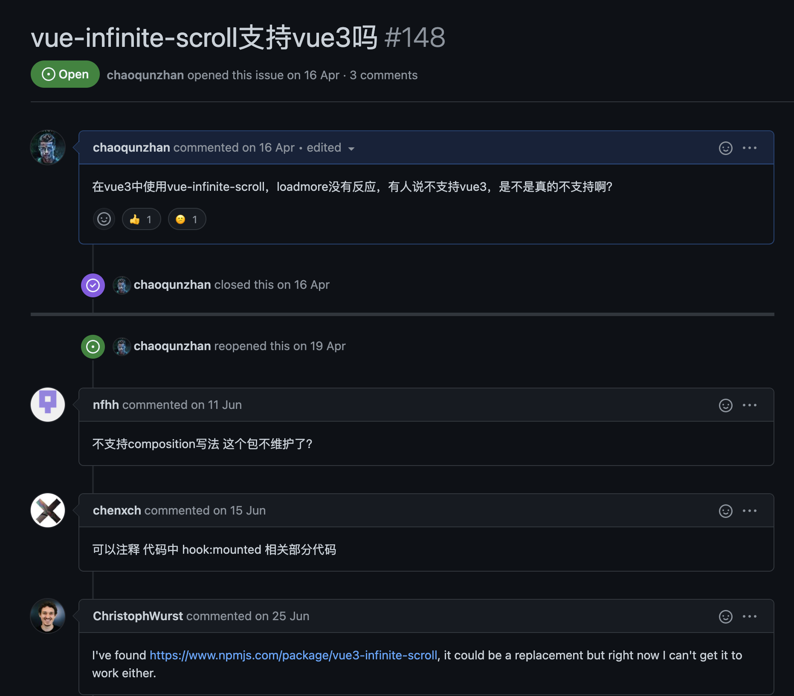

# vue3 无限滚动
## 零、为何造轮子

最近项目由`vue2`切换成`vue3`，因为某种原因UI框架选择的是`ant design 2.0`,`ant design 2.0`虽然升级了1.0的大部分组件，但是`list`组件只有手动触发的`loadmore`。业务上的需要，我们必须使用用户体验更好的无限滚动加载。通过`ant design 1.0`文档，可以看到官方推荐的方法是`vue-infinite-scroll`这个现在已经不在维护的插件，`vue-infinite-scroll`确实是个好插件，但就是不支持`vue3`。

<!--  -->


事实也证明这个插件已经没人维护了，所以目前项目中我们采用一个比较蠢的方案，引入`element-ui plus`，因为`element-ui plus`有`v-infinite-scroll`无限加载组件，等于说为了用一个组件，我们引入了一个组件库。这也给我们项目的性能造成了很大没必要的损耗。所以最近就决定好好理解一下`vue-infinite-scroll`源码，把它改造成`vue3`版本。花了几个周末终于搞定，虽然还没正式应用，但也做个总结。

## 一、[vue-infinite-scroll](https://github.com/ElemeFE/vue-infinite-scroll)源码解读


```js
//index.js
import InfiniteScroll from './directive';

const install = function(Vue) {
  Vue.directive('InfiniteScroll', InfiniteScroll);
};

if (window.Vue) {
  window.infiniteScroll = InfiniteScroll;
  Vue.use(install); // eslint-disable-line
}

InfiniteScroll.install = install;
export default InfiniteScroll;
```


```js
//directive.js
export default {
  bind(el, binding, vnode) {
    el[ctx] = {
      el,
      vm: vnode.context,     //虚拟节点所处上下文环境
      expression: binding.value  
    };
    const args = arguments;
    el[ctx].vm.$on('hook:mounted', function () {   //监听mounted生命周期
      el[ctx].vm.$nextTick(function () {
        if (isAttached(el)) {
          doBind.call(el[ctx], args);
        }

        el[ctx].bindTryCount = 0;

        var tryBind = function () {
          if (el[ctx].bindTryCount > 10) return; //eslint-disable-line
          el[ctx].bindTryCount++;
          if (isAttached(el)) {
            doBind.call(el[ctx], args);
          } else {
            setTimeout(tryBind, 50);
          }
        };

        tryBind();
      });
    });
  },

  unbind(el) {
    if (el && el[ctx] && el[ctx].scrollEventTarget)
      el[ctx].scrollEventTarget.removeEventListener('scroll', el[ctx].scrollListener);
  }
};
```


### 1.1  [注册或检索全局指令](https://v3.cn.vuejs.org/api/application-api.html#directive)

```javascript
// 注册一个全局自定义指令 `my-directive`
Vue.directive('my-directive', {
  bind: function (el, bind, vnode, oldVnode) {},  //只调用一次，指令第一次绑定到元素时调用。在这里可以进行一次性的初始化设置。
  inserted: function () {},                       //被绑定元素插入父节点时调用 (仅保证父节点存在，但不一定已被插入文档中)。
  update: function () {},                         //所在组件的 VNode 更新时调用，但是可能发生在其子 VNode 更新之前。
  componentUpdated: function () {},               //指令所在组件的 VNode 及其子 VNode 全部更新后调用。
  unbind: function () {}                          //只调用一次，指令与元素解绑时调用。
})
```

钩子函数的参数：

- `el`：指令所绑定的元素，可以用来直接操作 DOM。
- binding：一个对象，包含以下 property：
  - `name`：指令名，不包括 `v-` 前缀。
  - `value`：指令的绑定值，例如：`v-my-directive="1 + 1"` 中，绑定值为 `2`。
  - `oldValue`：指令绑定的前一个值，仅在 `update` 和 `componentUpdated` 钩子中可用。无论值是否改变都可用。
  - `expression`：字符串形式的指令表达式。例如 `v-my-directive="1 + 1"` 中，表达式为 `"1 + 1"`。
  - `arg`：传给指令的参数，可选。例如 `v-my-directive:foo` 中，参数为 `"foo"`。
  - `modifiers`：一个包含修饰符的对象。例如：`v-my-directive.foo.bar` 中，修饰符对象为 `{ foo: true, bar: true }`。
- `vnode`：Vue 编译生成的虚拟节点。移步 [VNode API](https://cn.vuejs.org/v2/api/#VNode-接口) 来了解更多详情。
- `oldVnode`：上一个虚拟节点，仅在 `update` 和 `componentUpdated` 钩子中可用


### 1.2 代码分析

`directive.js`主要返回`bind()`和`unbind()`两个方法，`bind()`用来进行初始化，这里主要是初始化滚动加载的配置和监听滚动事件,`unbind()`用于组件销毁时解除滚动事件的监听。`bind()`中有三个方法： `isAttached()`、 `tryBind()`、`doBind()` 

```js
//isAttached()
var isAttached = function (element) {
  var currentNode = element.parentNode;
  while (currentNode) {
    if (currentNode.tagName === 'HTML') {
      return true;
    }
    if (currentNode.nodeType === 11) {
      return false;
    }
    currentNode = currentNode.parentNode;
  }
  return false;
};
```

 `isAttached()`用于判断当前的虚拟节点上层是否存在`HTML`,`currentNode.nodeType === 11`表示`DocumentFragment`,是一种文档片段，没有父对象的最小文档对象。

 `tryBind()`用于绑定事件尝试，这里设置了十次尝试，超过就放弃了，hhh。

```js
//doBind()
var doBind = function () {
  if (this.binded) return; // eslint-disable-line
  this.binded = true;
  var directive = this;
  var element = directive.el;
  var throttleDelayExpr = element.getAttribute('infinite-scroll-throttle-delay');
  var throttleDelay = 200;
  if (throttleDelayExpr) {
    throttleDelay = Number(directive.vm[throttleDelayExpr] || throttleDelayExpr);
    if (isNaN(throttleDelay) || throttleDelay < 0) {
      throttleDelay = 200;
    }
  }
  
  directive.throttleDelay = throttleDelay;    //设置节流的时间，默认为200ms
  directive.scrollEventTarget = getScrollEventTarget(element);    //获取滚动事件监听的目标
  directive.scrollListener = throttle(doCheck.bind(directive), directive.throttleDelay);  //节流函数
  directive.scrollEventTarget.addEventListener('scroll', directive.scrollListener);   //添加监听事件
  
  this.vm.$on('hook:beforeDestroy', function () {   //在组件销毁之前去除监听事件
    directive.scrollEventTarget.removeEventListener('scroll', directive.scrollListener);
  });
  
  var disabledExpr = element.getAttribute('infinite-scroll-disabled');
  var disabled = false;
  if (disabledExpr) {
    this.vm.$watch(disabledExpr, function(value) {    //处理没有出现滚动条的情况
      directive.disabled = value;
      if (!value && directive.immediateCheck) {
        doCheck.call(directive);
      }
    });
    disabled = Boolean(directive.vm[disabledExpr]);
  }
  directive.disabled = disabled;
  
  var distanceExpr = element.getAttribute('infinite-scroll-distance');    //滚动触发加载事件，距离底部的高度
  var distance = 0;
  if (distanceExpr) {
    distance = Number(directive.vm[distanceExpr] || distanceExpr);
    if (isNaN(distance)) {
      distance = 0;
    }
  }
  directive.distance = distance;
  var immediateCheckExpr = element.getAttribute('infinite-scroll-immediate-check');
  var immediateCheck = true;
  if (immediateCheckExpr) {
    immediateCheck = Boolean(directive.vm[immediateCheckExpr]);
  }
  directive.immediateCheck = immediateCheck;
  if (immediateCheck) {
    doCheck.call(directive);
  }
  var eventName = element.getAttribute('infinite-scroll-listen-for-event');
  if (eventName) {
    directive.vm.$on(eventName, function() {
      doCheck.call(directive);
    });
  }
};
```

可以看到vue-infinite-scroller组件的传入参数都在`doBind()`这个方法中出现，所有这个方法就是该组件的核心无疑了。

| Option                           | Description                                                  |
| -------------------------------- | ------------------------------------------------------------ |
| infinite-scroll-disabled         | infinite scroll will be disabled if the value of this attribute is true. |
| infinite-scroll-distance         | Number(default = 0) - the minimum distance between the bottom of the element and the bottom of the viewport before the v-infinite-scroll method is executed. |
| infinite-scroll-immediate-check  | Boolean(default = true) - indicates that the directive should check immediately after bind. Useful if it's possible that the content is not tall enough to fill up the scrollable container. |
| infinite-scroll-listen-for-event | infinite scroll will check again when the event is emitted in Vue instance. |
| infinite-scroll-throttle-delay   | Number(default = 200) - interval(ms) between next time checking and this time |


被`addEventListener`到节点的事件其实是`doCheck()`

```js
//doCheck()
var doCheck = function (force) {
  var scrollEventTarget = this.scrollEventTarget;
  var element = this.el;
  var distance = this.distance;
  if (force !== true && this.disabled) return; //eslint-disable-line
  var viewportScrollTop = getScrollTop(scrollEventTarget);
  var viewportBottom = viewportScrollTop + getVisibleHeight(scrollEventTarget);
  var shouldTrigger = false;
  if (scrollEventTarget === element) {
    shouldTrigger = scrollEventTarget.scrollHeight - viewportBottom <= distance;
  //shouldTrigger=scrollEventTarget.scrollHeight-（getScrollTop(scrollEventTarget) + getVisibleHeight(scrollEventTarget)）<= distance
  } else {
    var elementBottom = getElementTop(element) - getElementTop(scrollEventTarget) + element.offsetHeight + viewportScrollTop;
    shouldTrigger = viewportBottom + distance >= elementBottom;
  }
  if (shouldTrigger && this.expression) {   //滚动到底就执行expression()加载
    this.expression();
  }
};
```

<!--  -->

在滚动元素和加载元素一样的情况下和简单用上图理解，判断是否滚动到底的条件就是`scrollTop+clientHeight-scrollHeight<=distance`，这里的`distance`没有标记，可以认为是0。在滚动元素和加载元素不一样的情况下，要通过判断可视窗口的底部加`distance`的距离是否大于等于加载元素的底部。

<!--  -->

这么看来，似乎好像就可以完成我们想要的效果了，滚动到底后触发加载事件。但其实优上面的图可以看出，在加载的元素没有填满视图的时候，是不会出现滚动条的，也就是上面说的scrollTop`为0，而且监听的滚动事件也根本不存在，就无法触发`doCheck()`了。		

因此在上面的代码中有了`this.vm.$watch`来监听`var disabledExpr = element.getAttribute('infinite-scroll-disabled');`，只要`infinite-scroll-disabled`变为`false`，就会触发`doCheck()`。而在使用组件的时候`infinite-scroll-disabled`在`expression`方法执行中会被设置为`true`，在执行后被设置为`false`。所以通过监听`infinite-scroll-disabled`可以触发加载方法，直到元素出现滚动条，接下去就是`addEventListener`的任务了。

```js
if (immediateCheck) {
  doCheck.call(directive);
}
```

`immediateCheck`表示立即执行，默认为`true	`，用于触发首次加载。


## 二、重写Vue3版本的`vue-infinite-scroll插件

### 2.1 对比vue3和vue2

和vue2(详见1.1)不同的是vue3的自定义指令钩子函数已经改为和生命周期的钩子函数一致。

```js
// 注册
app.directive('my-directive', {
  // 指令是具有一组生命周期的钩子：
  // 在绑定元素的 attribute 或事件监听器被应用之前调用
  created() {},
  // 在绑定元素的父组件挂载之前调用
  beforeMount() {},
  // 绑定元素的父组件被挂载时调用
  mounted() {},
  // 在包含组件的 VNode 更新之前调用
  beforeUpdate() {},
  // 在包含组件的 VNode 及其子组件的 VNode 更新之后调用
  updated() {},
  // 在绑定元素的父组件卸载之前调用
  beforeUnmount() {},
  // 卸载绑定元素的父组件时调用
  unmounted() {}
})
```

这也是vue-infinité-scroll不适用于vue3的关键原因，所以在新的插件中，自定义指令将适配vue3。主要用到`mounted`和`unmounted`，滚动监听将被定义在`mounted`中，这是因为dom元素只有被渲染完成才能获取高度等物理参数。


### 2.2 MutationObserver

[`MutationObserver`](https://developer.mozilla.org/zh-CN/docs/Web/API/MutationObserver)接口提供了监视对DOM树所做更改的能力。它被设计为旧的Mutation Events功能的替代品，该功能是DOM3 Events规范的一部分。

```js
// 创建一个观察器实例并传入回调函数
const observer = new MutationObserver(callback);// 以上述配置开始观察目标节点
observer.observe(targetNode, config);// 之后，可停止观察observer.disconnect();
```

上面介绍了滚动插件的两个状态，一种是没有出现滚动条也就是元素没有被填满，另一种是出现滚动条，滚动条触底的情况。在第一种情况中，我们将采用`MutationObserver`处理，监视目标DOM树的变化。在每次DOM树变化之后都会检查是否出现滚动条，出现了就去除`MutationObserver`监视，否则执行传入的方法，添加元素。详情可以看下面的完整代码。

参考：https://developer.mozilla.org/zh-CN/docs/Web/API/MutationObserver


### 2.3 getAttribute

**`getAttribute()`** 返回元素上一个指定的属性值。如果指定的属性不存在，则返回  `null` 或 `""` （空字符串）；具体细节, 请参阅 [Notes](https://developer.mozilla.org/zh-CN/docs/Web/API/Element/getAttribute#notes) 部分。


### 2.4 element对象

element表示HTML元素，在这里我们主要关注nodeType和tagName两个element属性，`getScrollEventTarget`方法中用这俩属性来找出文档中的滚动元素。

#### element.nodeType：

| `Node.ELEMENT_NODE`                | `1`  | 一个 [`元素`](https://developer.mozilla.org/zh-CN/docs/Web/API/Element) 节点，例如 [``](https://developer.mozilla.org/zh-CN/docs/Web/HTML/Element/p) 和 [``](https://developer.mozilla.org/zh-CN/docs/Web/HTML/Element/div)。 |
| ---------------------------------- | ---- | ------------------------------------------------------------ |
| `Node.TEXT_NODE`                   | `3`  | [`Element`](https://developer.mozilla.org/zh-CN/docs/Web/API/Element) 或者 [`Attr`](https://developer.mozilla.org/zh-CN/docs/Web/API/Attr) 中实际的 [`文字`](https://developer.mozilla.org/zh-CN/docs/Web/API/Text) |
| `Node.CDATA_SECTION_NODE`          | `4`  | 一个 [`CDATASection`](https://developer.mozilla.org/zh-CN/docs/Web/API/CDATASection)，例如 `<!CDATA[[ … ]]>`。 |
| `Node.PROCESSING_INSTRUCTION_NODE` | `7`  | 一个用于XML文档的 [`ProcessingInstruction` (en-US)](https://developer.mozilla.org/en-US/docs/Web/API/ProcessingInstruction) ，例如 `<?xml-stylesheet ... ?>` 声明。 |
| `Node.COMMENT_NODE`                | `8`  | 一个 [`Comment`](https://developer.mozilla.org/zh-CN/docs/Web/API/Comment) 节点。 |
| `Node.DOCUMENT_NODE`               | `9`  | 一个 [`Document`](https://developer.mozilla.org/zh-CN/docs/Web/API/Document) 节点。 |
| `Node.DOCUMENT_TYPE_NODE`          | `10` | 描述文档类型的 [`DocumentType`](https://developer.mozilla.org/zh-CN/docs/Web/API/DocumentType) 节点。例如 `<!DOCTYPE html>` 就是用于 HTML5 的。 |
| `Node.DOCUMENT_FRAGMENT_NODE`      | `11` | 一个 [`DocumentFragment`](https://developer.mozilla.org/zh-CN/docs/Web/API/DocumentFragment) 节点 |

#### element.tagName:

`elementName` 是一个字符串,包含了element元素的标签名


### 2.3 完整代码

```js
import {nextTick} from 'vue';
export const SCOPE = 'Vue3InfiniteScroll'
const InfiniteScroll = {
  mounted (el, binding, vnode) {
    const checkFull = ()=>{
      if(document.documentElement.clientHeight >= el.clientHeight){
        el[SCOPE].expression.call();
      }else{
        if(el.observer){
          el.observer.disconnect();
        }
      }
    };

    const doCheck = ()=>{
      const { container } = el[SCOPE];
      const containerScrollTop = container===window?container.document.documentElement.scrollTop:container.scrollTop;
      const containerClientHeight = container===window?container.document.documentElement.clientHeight:container.clientHeight;
      const elClientHeight = el.clientHeight;
      const shouldTrigger = containerScrollTop + containerClientHeight +  200 > elClientHeight;
      if(shouldTrigger){
        el[SCOPE].expression.call();
      }
    };
    
    const throttle = (fn, delay) => {
      //节流函数
      var now, lastExec, timer, context, args; //eslint-disable-line
      var execute = function () {
        fn.apply(context, args);
        lastExec = now;
      };
      return function () {
        context = this;
        args = arguments;

        now = Date.now();

        if (timer) {
          clearTimeout(timer);
          timer = null;
        }

        if (lastExec) {
          var diff = delay - (now - lastExec);
          if (diff < 0) {
            execute();
          } else {
            timer = setTimeout(() => {
              execute();
            }, diff);
          }
        } else {
          execute();
        }
      };
    };
    
		 //获取添加监听的Dom,获取到overflowY设置为‘scroll’或者‘auto’的节点，或者返回window对象
    const getScrollEventTarget =  (element)=> {    
      let currentNode = element;
      while (currentNode && currentNode.tagName !== 'HTML' && currentNode.tagName !== 'BODY' && currentNode.nodeType === 1) {
        const overflowY = getComputedStyle(currentNode).overflowY;
        if (overflowY === 'scroll' || overflowY === 'auto') {
          return currentNode;
        }
        currentNode = currentNode.parentNode;
      }
      return window;
    };

    const throttleDelayExpr = el.getAttribute('infinite-scroll-throttle-delay')?el.getAttribute('infinite-scroll-throttle-delay'):1000;
    el[SCOPE] = { 
      el,
      vm: vnode.context,
      expression: binding.value,
      config:{
        eventName:el.getAttribute('infinite-scroll-listen-for-event'),
        immediateCheckExpr:el.getAttribute('infinite-scroll-immediate-check')?el.getAttribute('infinite-scroll-immediate-check'):true,
        distanceExpr:el.getAttribute('infinite-scroll-distance')?el.getAttribute('infinite-scroll-distance'):200,
        throttleDelayExpr
      },
      container:getScrollEventTarget(el),
      onScroller:throttle(doCheck,throttleDelayExpr),
    };
    
    const bind = async () => {
      await nextTick();
      const { config, onScroller } = el[SCOPE];
      if (config.immediateCheckExpr) {
        const observer = new MutationObserver(
          checkFull
        )
        el.observer = observer;      //设置成全局
        observer.observe(el, { attributes: true, childList: true, subtree: true });
      }
      el[SCOPE].container.addEventListener("scroll",onScroller );
      el[SCOPE].expression.call();
    }
    bind();
  },
  unmounted(el) {
    const { container, onScroller } = el[SCOPE]
    container?.removeEventListener('scroll', onScroller)
    destroyObserver(el)
  }
};
export default InfiniteScroll;
```

未完待续。。。


