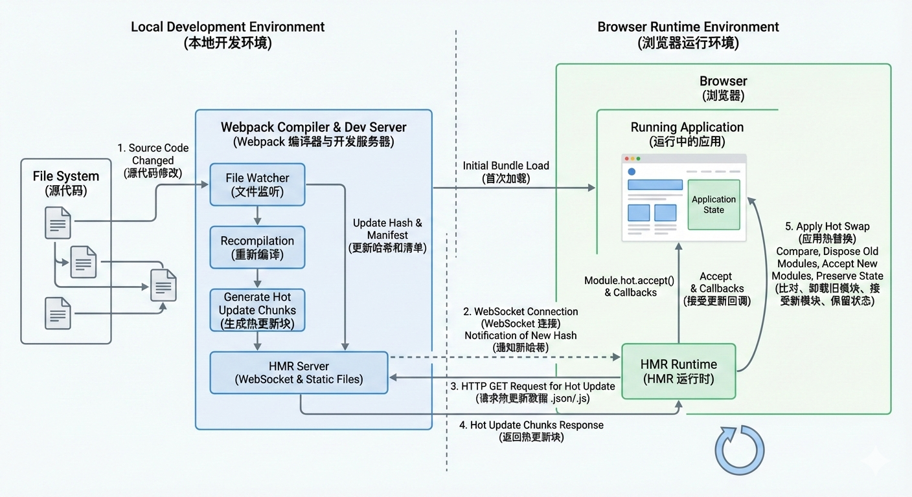

Webpack 的 **HMR (Hot Module Replacement)** 即“模块热替换”，是前端开发中最强大的功能之一。它允许在**不刷新整个浏览器页面**的情况下，通过替换更新的模块来实时预览修改结果。

这不仅节省了开发时间，更重要的是它可以**保留应用的状态**（例如：你在输入框填写的文字、模态框的打开状态等），这是普通的“Live Reload”（自动刷新）做不到的。

以下是 Webpack HMR 的底层原理全流程解析。

---



### 1. 核心角色 (The Actors)

要理解流程，首先要认识参与其中的四个主要角色：

1. **Webpack Compiler (服务端):** 负责监听文件变化，将源代码编译成 Bundle（构建包）。
2. **HMR Server (服务端):** 通常由 `webpack-dev-server` (WDS) 扮演。它建立服务端与浏览器的 WebSocket 连接，用于推送更新通知。
3. **HMR Runtime (浏览器端):** 注入到浏览器运行环境中的一段 JS 代码。它通过 WebSocket 接收服务端的通知，并负责请求更新的模块。
4. **Bundle Server (服务端):** 负责让浏览器请求到编译后的静态资源（JS/CSS）。

---

### 2. HMR 全流程详解

我们将 HMR 的过程分为两个阶段：**启动阶段**和**更新阶段**。

#### 第一阶段：启动阶段 (Startup)

1. **编译:** Webpack 将代码编译打包。
2. **注入:** 在打包过程中，Webpack 会自动将 **HMR Runtime** 代码注入 to bundle.js 中。
3. **服务:** 浏览器加载页面，执行 bundle.js，HMR Runtime 启动，并与 HMR Server 建立 **WebSocket** 连接。

#### 第二阶段：更新阶段 (The Update Loop)

这是 HMR 的核心魔法所在，当你在编辑器保存文件时：

**步骤 1：监听与增量编译 (File Change & Compile)**

* Webpack 监听到文件变化（File Change）。
* Webpack 并非重新打包所有文件，而是进行**增量构建**。它会生成两个关键文件：
* **JSON Manifest:** 描述发生变化的文件列表和新的 Hash 值（例如 `h.1234.hot-update.json`）。
* **JS Chunk:** 包含实际更新的代码片段（例如 `main.1234.hot-update.js`）。


**步骤 2：推送通知 (Notification)**

* HMR Server 通过 WebSocket 向浏览器的 HMR Runtime 发送消息：
* 消息类型：`hash` (告知最新构建的 Hash 值)。
* 消息类型：`ok` (告知构建完成)。


**步骤 3：浏览器请求更新 (Fetch Updates)**

* HMR Runtime 收到 `ok` 消息后，对比旧 Hash 和新 Hash。
* 如果有更新，Runtime 会发起 Ajax 请求获取 **JSON Manifest**，了解哪些模块变了。
* 接着，Runtime 通过 JSONP (添加 `<script>` 标签) 请求具体的 **JS Chunk**。

**步骤 4：模块替换 (Module Replacement)**
这是最关键的一步。浏览器拿到了新代码，如何替换旧代码？

1. **找出过期的模块:** Runtime 解析下载回来的 JS Chunk。
2. **检查依赖 (Bubbling):** HMR Runtime 会从发生变化的模块开始，向上查找其父模块，看是否有模块通过 `module.hot.accept` 注册了回调函数来处理更新。
* **如果找到:** 执行回调，进行模块替换。
* **如果没找到:** 继续向上一层父模块查找（冒泡）。
* **如果冒泡到根模块仍未处理:** HMR 失败，回退到**整页刷新 (window.location.reload)**。


---

### 3. 核心技术细节 Q&A

为了更深入理解，我们需要解答几个关键技术点：

#### Q1: 旧模块怎么被“替换”的？

Webpack 的模块加载本质上是维护了一个 `installedModules` 对象（缓存）。
当替换发生时，HMR Runtime 会做以下几件事：

1. **删除缓存:** 从 `installedModules` 中删除过期模块的 ID。
2. **执行新代码:** 执行新下载的 JS Chunk 中的代码。
3. **更新父模块引用:** 当父模块重新执行（或执行回调）时，它再次调用 `__webpack_require__`，此时因为缓存已被删除，Webpack 会加载并执行新的模块代码。

#### Q2: 为什么需要 JSON Manifest？

因为浏览器端并不知道具体是哪个模块变了，也不知道新的 Hash 是多少。Manifest 就像一份“更新清单”，告诉浏览器：“嘿，这次构建版本号是 X，其中 chunk A 和 chunk B 发生了变化，去下载它们吧。”

#### Q3: 为什么有时候修改代码会导致页面刷新？

这就是**“冒泡机制” (Bubbling)** 的结果。
大多数现代框架（React, Vue）都有对应的 Loader（如 `vue-loader`, `react-refresh`）帮我们在底层自动写好了 `module.hot.accept` 代码。
但是，如果你修改了一个没有被任何组件捕获处理的底层 JS 文件，或者修改了 `index.html` 入口文件，Webpack 找不到接收更新的地方，为了保证代码逻辑正确，它只能选择刷新整个页面。

---

### 4. 代码层面的样子

虽然我们平时不用手写，但 HMR 的 API 长这样：

```javascript
// index.js (入口文件示例)
import render from './render';

render();

// 只有加上这段代码，index.js 及其依赖发生变化时，才不会刷新页面
if (module.hot) {
  // 接受 './render' 模块的更新
  module.hot.accept('./render', () => {
    console.log('检测到 render 模块更新，执行热替换逻辑...');
    // 重新执行渲染逻辑，或者保留状态重新挂载组件
    render(); 
  });
}

```

### 总结

Webpack HMR 的流程可以浓缩为：
**监听 -> 增量编译 -> Socket 推送 -> 请求 Manifest -> 下载 Update Chunk -> 冒泡查找 Accept -> 替换缓存并执行 -> (若失败则刷新页面)**

---

**我可以为您做些什么：**
您想了解在 **React** 或 **Vue** 项目中，HMR 具体是如何与框架结合（例如 React Refresh 或 Vue Loader）来实现组件级状态保留的吗？